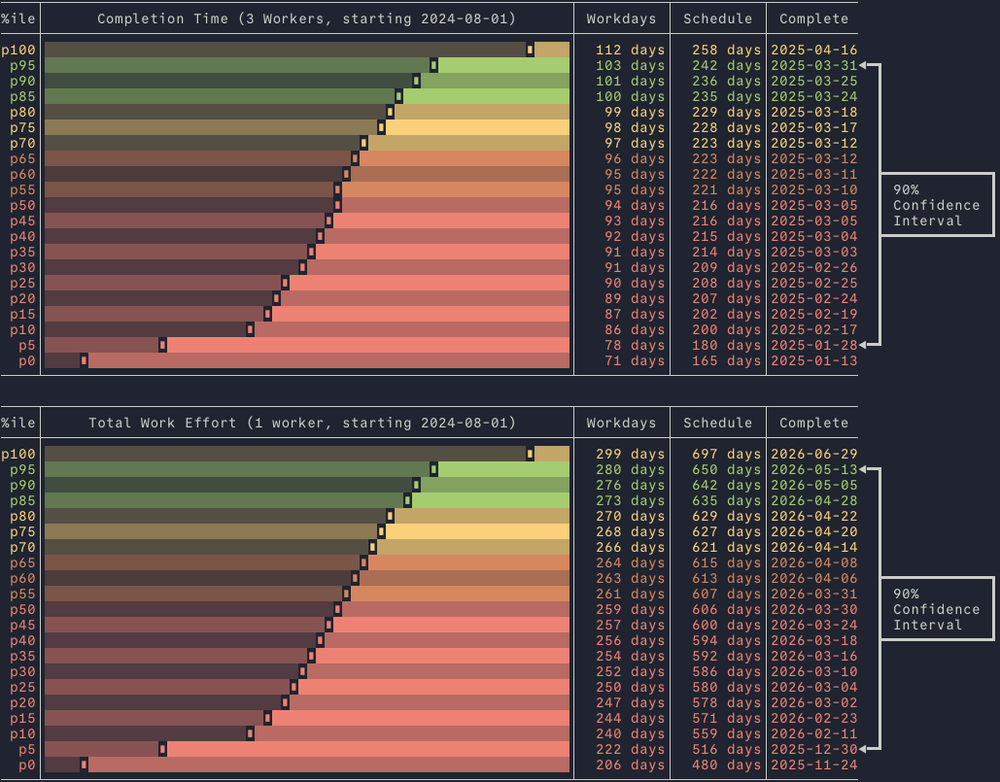

# Monte Carlo Project Scheduler (mcps)

Monte Carlo Project Scheduler (mcps) is a command-line tool that runs Monte
Carlo simulations on project schedules to estimate completion times and effort
required. It helps project managers and engineers gain a better understanding of
potential project risks and timelines by providing a probabilistic analysis of
schedule durations and total work effort.

## Features

- **Simulate Project Schedules**: Run multiple simulations to estimate the
  probability distribution of project completion times and total work effort.
- **Customizable Inputs**: Accepts project schedules in YAML or JSON formats,
  with options to override certain parameters like the number of workers or the
  number of iterations.
- **Visual Output**: Generates an ASCII-based cumulative distribution function
  (CDF) graph, providing an easy-to-understand visualization of the simulation
  results.

## Installation

### Prerequisites

- **Rust**: You'll need to have Rust installed on your system to build the
  project. You can install Rust using `rustup`:

  ```bash
  curl --proto '=https' --tlsv1.2 -sSf https://sh.rustup.rs | sh
  ```

### Building from Source

- Clone and build the repository:

```bash
git clone <git@git.sr.ht>:~swaits/mcps
cd mcps
cargo build --release
```

The binary will be available at `target/release/mcps`.

## Usage

Once you have built the tool, you can use it by providing a project schedule
file in YAML or JSON format.

### Basic Usage

```bash
./mcps example.yaml -i 100000 -w 10
```

This command runs the Monte Carlo simulation on the example.yaml schedule file
with 100,000 iterations and overrides the number of workers to 10.

### Command-Line Options

- `-i, --iterations <iterations>`: Specify the number of iterations to run. Must be at least 100. Default is 50,000.
- `-w, --workers <num_workers>`: Override the number of workers specified in the schedule file.
- `-v, --version`: Print version information.
- `-h, --help`: Print help information.

### Schedule File Format

The tool accepts schedule files in YAML or JSON format. Below is an example of the YAML format:

```yaml
num_workers: 5 # for the purpose of scheduling simulation
estimate_confidence: 0.80 # confidence actuals will fall inside estimate bounds
tasks:
  - id: DesignPhase
    min_time: 1.5 # 1.5 days
    max_time: 3.5 # 3.5 days
    dependencies: []
  - id: ImplementationPhase
    min_time: 2.25 # 2.25 days
    max_time: 4.75 # 4.75 days
    dependencies: [DesignPhase]
```

### Example Output

The tool generates an ASCII-based cumulative distribution function (CDF) graph,
which visually represents the distribution of project durations and effort:



## Project Details

### Contributing

Contributions are welcome! If you'd like to contribute, please fork the
repository and make changes as you'd like. Pull requests are warmly welcomed.

### Issues

If you encounter any issues with the tool, feel free to open an issue on the repository.

### Acknowledgments

This tool was developed by Stephen Waits. Contributions and suggestions are
always welcome!

### License

This project is licensed under the MIT License. See the LICENSE file for details.
